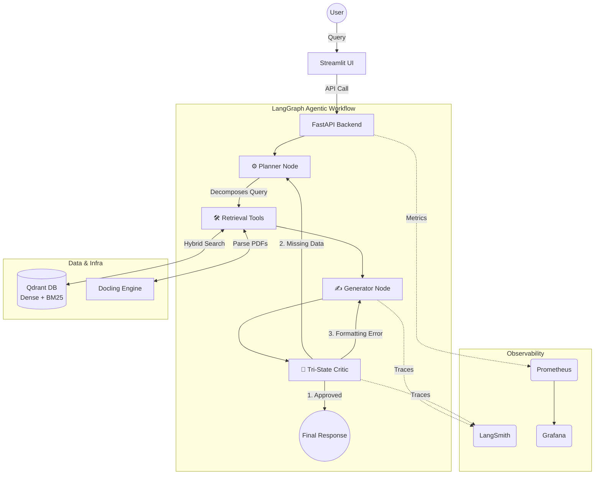

# Financial Agentic RAG system (FARS)

[](https://www.python.org/downloads/)
[](https://github.com/astral-sh/uv)
[](https://www.docker.com/)
[](https://fastapi.tiangolo.com/)
[](https://qdrant.tech/)
[](https://github.com/DS4SD/docling)
[](https://openai.com/)
[](https://langchain.com/)
[](https://langchain.com/)
[](https://docs.vllm.ai/)
[](https://github.com/confident-ai/deepeval)
[](https://smith.langchain.com/)
[](https://mlflow.org/)
[](https://prometheus.io/)
[](https://grafana.com/)
## Overview
**FARS** is a production-ready, agentic Retrieval-Augmented Generation (RAG) system engineered to autonomously analyze and extract insights from financial reports of 10-Q form.

## System in Action


## Key Capabilities
* **Multi-Hop Reasoning:** Planner agent node can execute multiple searches to compare different companies or fiscal years in a single pass
* **Hybrid Search:** Semantic + BM25
* **Self-Correcting Critic:** Critic agent node evaluates draft answers. If data is missing, it routes the agent to fetch more data before showing the user.
* **Quantifiable Reliability:** LLM-as-a-judge metrics guarantee high faithfulness and low hallucinations.


## 🏗️ System Architecture

### 1. Ingestion & Indexing Pipeline
* **Document Parsing:** Utilizes the Docling API to parse complex financial PDFs into structured Markdown.
* **Contextual Enrichment:** Condenses tables and dynamically injects hierarchical metadata (Ticker, Year, Quarter, Section Path) into every chunk to eliminate context fragmentation.
* **Hybrid Vector Store:** Upserts both Dense embeddings (`text-embedding-3-small`) and Sparse vectors (`Qdrant/bm25` via FastEmbed) into a local Qdrant container.

### 2. Agentic Workflow
* **Orchestration:** Powered by `LangGraph` for stateful, cyclic agent execution. Implemented with 2 agent nodes: Main and Critic the latter for verification of an answer given by Main agent.
* **Dynamic Tooling:** Custom tools autonomously adjust retrieval parameters (e.g., switching search algorithms, number of retrieved documents) based on real-time configuration contexts.

### 3. MLOps & Evaluation Pipeline
* **Experiment Tracking:** `MLflow` logs hyperparameter sweeps (A/B testing search algorithms, `chunk_size`, `top_k`, different document parsers).
* **Telemetry:** `LangSmith` traces multi-stage agent trajectories and tool invocations.

---

## 📊 Production & Business Metrics
Evaluating autonomous agents requires moving beyond basic chunk-level matching. This system implements a robust suite of custom and LLM-assisted metrics to measure true business utility.

### 1. Retrieval Metrics (Custom Document-Level Eval)
*Standard `Precision@K` fails for agents that make multiple tool calls. These custom metrics evaluate the holistic retrieval session.*
* **Document Recall:** Measures the percentage of expected golden documents successfully retrieved by the agent across all tool calls. 
* **Document Precision:** Measures the percentage of unique retrieved documents that were actually relevant to the query.

### 2. Generation Metrics (LLM-as-a-Judge via DeepEval)
* **Faithfulness:** Measures hallucination rates. Ensures every claim made by the LLM is directly backed by the retrieved SEC context.
* **Answer Relevancy:** Ensures the final output directly answers the user's prompt without unnecessary verbosity.
* **Contextual Recall:** Evaluates if the retrieved context was sufficient for the LLM to formulate a complete answer.

### 🏆 Benchmark Results (Example)
Transitioning from Dense-only search to **Hybrid Search (RRF)** yielded significant improvements on the internal Gold Benchmark dataset:

| Search Strategy | Document Recall | Document Precision | Faithfulness | Answer Relevancy |
|-----------------|-----------------|--------------------|--------------|------------------|
| Dense Only      | 0.65            | 0.40               | 0.88         | 0.82             |
| BM25 Only       | 0.58            | 0.45               | 0.85         | 0.78             |
| **Hybrid (RRF)**| **0.94** | **0.88** | **0.99** | **0.96** |

---

## 🛠️ Tech Stack
* **AI/LLM Framework:** LangChain, LangGraph, OpenAI (`gpt-4o-mini`, `text-embedding-3-small`)
* **Vector Database:** Qdrant, FastEmbed (Local BM25)
* **MLOps & Eval:** MLflow, DeepEval, LangSmith
* **Infrastructure:** Docker, Docker Compose, `uv` (Python package manager)

---

## 🚀 Quick Start

### Prerequisites
* Docker & Docker Compose
* Python 3.10+
* OpenAI & LangChain API Keys

### Installation & Execution

1. **Clone the repository & Set Environment:**
   ```bash
   git clone [https://github.com/yourusername/SEC-Insight-Agent.git](https://github.com/yourusername/SEC-Insight-Agent.git)
   cd SEC-Insight-Agent
   
   # Create .env file
   echo "OPENAI_API_KEY=sk-your-key" >> .env
   echo "LANGCHAIN_API_KEY=ls-your-key" >> .env
   echo "LANGCHAIN_TRACING_V2=true" >> .env
   echo "LANGCHAIN_PROJECT=SEC_RAG_Eval" >> .env
   echo "QDRANT_HOST=localhost" >> .env
   echo "QDRANT_PORT=6333" >> .env


 **Start Infrastructure:**

   ```bash
   docker compose up -d --build
   ```
Run Ingestion (Populate Qdrant):
   ```bash
docker compose exec api uv run python -m src.data.ingest
   ```
Run MLOps Evaluation Sweeps:
   ```bash
docker compose exec api uv run python -m src.eval.run_sweep
   ```

### 🧠 The Critic's Paradox: Evaluator Variance vs. Agent Accuracy
During evaluation, an interesting paradox emerged: enabling the self-correcting Critic Agent resulted in vastly superior, mathematically accurate final answers, but occasionally caused `Contextual Recall` scores to drop precipitously (e.g., 0.83 → 0.00). 

**Root Cause Analysis:**
This was identified as an artifact of **LLM-as-a-Judge variance**, not an Agent failure.
1. **Decoupled Evaluation:** `Contextual Recall` evaluates the *Retrieval Engine* against the *Golden Answer*, completely ignoring the Agent's generated text. 
2. **Context Overload:** When the Critic triggers a secondary search, the context window grows. Supplying highly dense, tabular SEC data to a smaller evaluator model (`gpt-4o-mini`) triggered "Lost in the Middle" degradation. The judge failed to locate facts within the expanded context.
3. **Derived Math Penalties:** The Critic forces the Agent to calculate actual differences (e.g., "$1.571 billion decrease"). Strict evaluator models penalize this as "unsupported by context" because the derived integer does not explicitly exist in the retrieved text.

**The Solution:**
To stabilize enterprise-grade evaluation, we:
* Transitioned the DeepEval judge to `gpt-4o` for complex tabular cross-referencing.
* Implemented strict context deduplication prior to passing documents to the evaluation framework.
* Utilized `GEval` to instruct the judge to permit derived mathematics.

## 🔮 Future Roadmap
* **Two-Stage Retrieval (Cross-Encoder):** Fine-tune a lightweight open-source model (e.g., Llama-3-8B or BGE-M3) using LoRA/PEFT to rerank the broad candidate pool retrieved by Qdrant.
* **Data Interpreter Tool:** Integrate a Python REPL tool allowing the agent to perform complex tabular data analysis (e.g., YoY growth calculations) natively via Pandas.
* **Self-Hosted Inference (vLLM):** Transition away from proprietary API calls by hosting a quantized small language model locally or on a rented GPU instance using vLLM for high-throughput, cost-effective inference.
* **RL Post-Training for Financial Reasoning:** Align and fine-tune the self-hosted model specifically for financial data extraction and logical reasoning using state-of-the-art Reinforcement Learning techniques such as DPO (Direct Preference Optimization) or GRPO (Group Relative Policy Optimization).
* **Cloud-Native Deployment:** Migrate infrastructure to AWS ECS / RunPod Serverless for scalable API hosting.