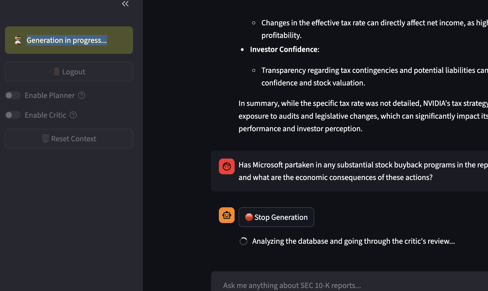
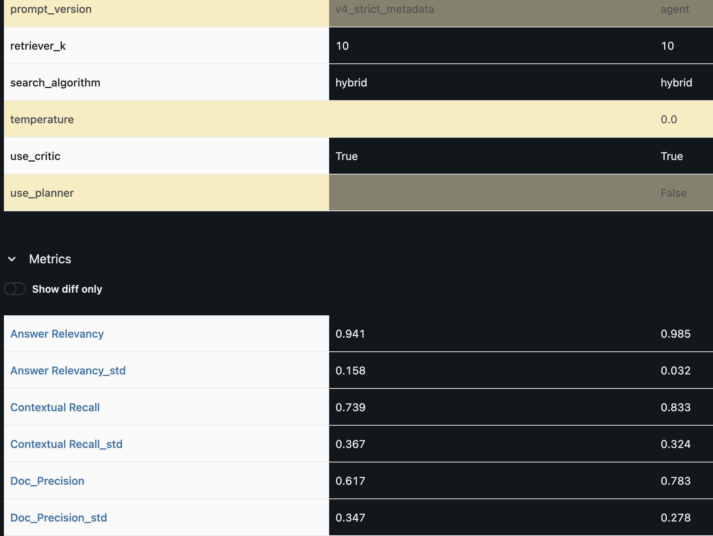
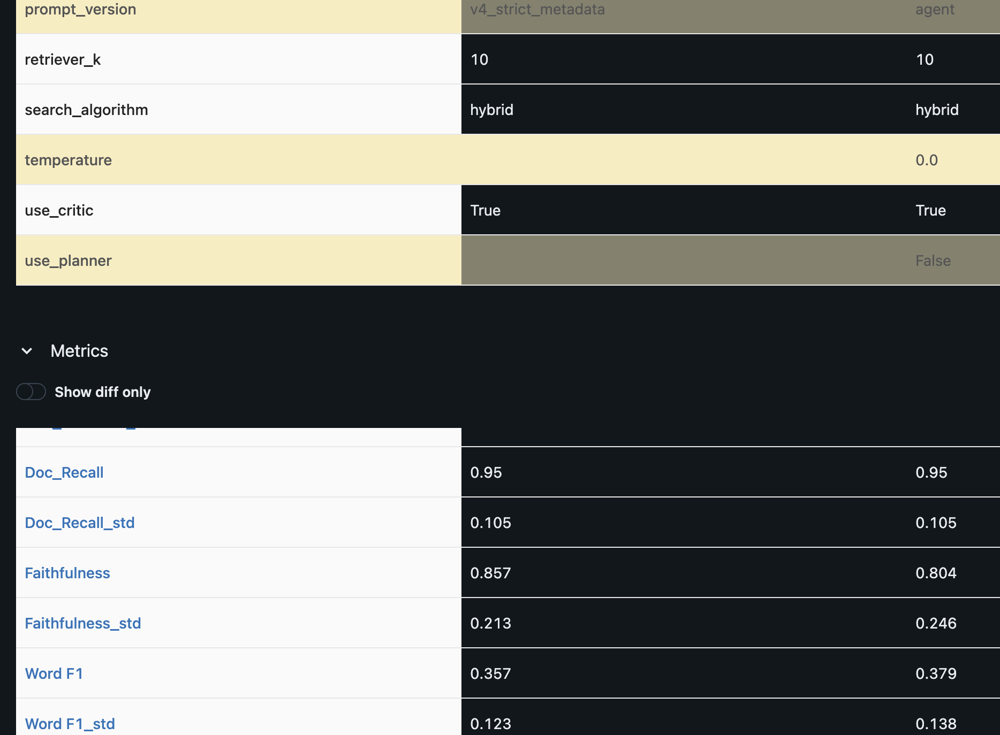

# Financial Agentic RAG system (FARS)

[](https://www.python.org/downloads/)
[](https://github.com/astral-sh/uv)
[](https://www.docker.com/)
[](https://cloud.google.com/)
[](https://fastapi.tiangolo.com/)
[](https://qdrant.tech/)
[](https://github.com/DS4SD/docling)
[](https://openai.com/)
[](https://langchain.com/)
[](https://langchain.com/)
[](https://docs.vllm.ai/)
[](https://github.com/confident-ai/deepeval)
[](https://smith.langchain.com/)
[](https://mlflow.org/)
[](https://prometheus.io/)
[](https://grafana.com/)
## Overview
**FARS** is a production-ready, agentic Retrieval-Augmented Generation (RAG) system engineered to autonomously analyze and extract insights from financial reports of 10-Q form. FARS is fully hosted on Google Cloud Platform and exposed on external IP.

## System in Action


## Key Capabilities
* **Multi-Hop Reasoning:** Planner agent node can execute multiple searches to compare different companies or fiscal years in a single pass
* **Hybrid Search:** Semantic + BM25
* **Self-Correcting Critic:** Critic agent node evaluates draft answers. If data is missing, it routes the agent to fetch more data before showing the user.
* **Quantifiable Reliability:** LLM-as-a-judge metrics guarantee high faithfulness and low hallucinations.

## System Architecture


## Evaluation

### Prompts testing

Using MLflow comparing a standard prompt (`v4_strict_metadata`) against improved one (`agent`) we achieve better results.

| Evaluation Metric | `v4_strict_metadata` | `agent`|
| :--- | :--- | :--- |
| **Answer Relevancy** | 0.941 | **0.985** |
| **Contextual Recall** | 0.739 | **0.833** |
| **Doc Precision** | 0.617 | **0.783** |
| **Doc Recall** | 0.950 | 0.950 |
| **Faithfulness** | **0.857** | 0.804 |
| **Word F1** | 0.357 | **0.379** |

<details>
<summary>View Raw MLflow Experiment Logs</summary>
<br>



</details>


Running 20+ experiment runs to find the best configuration. The following was fond:

| Component | Experiments Run | Winning Configuration |
| :--- | :--- | :--- |
| **Search Strategy** | Dense vs. BM25 vs. Hybrid | **Hybrid** |
| **Retrieval Depth** | k=3, 5, 10 | **k=10** |
| **Generation** | Temp 0.0, 0.1, 0.3 | **Temp 0.0** |
| **Query Logic** | Standard vs. Planner | **Planner** |
| **Verification** | Critic On vs. Off | **Critic off** |
| **Data Chunking** | 2k, 4k, 8k | **8000, 800 overlap** |

---


## Tech Stack
* **LLM Framework:** `LangChain`, `LangGraph`, `OpenAI`
* **Vector Database:** `Qdrant`, `FastEmbed`
* **MLOps & Eval:** `MLflow`, `DeepEval`, `LangSmith`, `Prometheus`, `Grafana`
* **Infrastructure:** `Docker`, `Google Cloud Platform`, `FastAPI`, `uv`
* **UI:** `Streamlit`

---

## Quick Start

### Installation & Execution

1. **Clone the repository & Set Environment:**
   ```bash
   git clone [https://github.com/yourusername/SEC-Insight-Agent.git](https://github.com/yourusername/SEC-Insight-Agent.git)
   cd SEC-Insight-Agent
   
   # Create .env file
   echo "OPENAI_API_KEY=sk-your-key" >> .env
   echo "LANGCHAIN_API_KEY=ls-your-key" >> .env
   echo "LANGCHAIN_TRACING_V2=true" >> .env
   echo "LANGCHAIN_PROJECT=your_name" >> .env
   echo "LANGSMITH_ENDPOINT=your_endpoint" >> .env
   echo"ACCESS_TOKEN_EXPIRE_MINUTES=1440" >> .env
   echo "JWT_SECRET_KEY=your_key" >> .env
   echo "JWT_ALGORITHM=HS256" >> .env
   echo "QDRANT_HOST=qdrant" >> .env
   echo "QDRANT_PORT=6333" >> .env
   echo "MONGO_URI=mongodb://mongodb:27017" >> .env

 **Start Infrastructure:**

   ```bash
   docker compose up -d --build
   ```
Run Ingestion (Populate Qdrant):
   ```bash
docker compose exec api uv run python -m src.data.ingest
   ```
Run MLOps Evaluation Sweeps:
   ```bash
docker compose exec api uv run python -m src.eval.run_sweep
   ```


## 🔮 Future Roadmap
* **Two-Stage Retrieval (Cross-Encoder):** Fine-tune a lightweight open-source model (e.g., Llama-3-8B or BGE-M3) using LoRA/PEFT to rerank the broad candidate pool retrieved by Qdrant.
* **Data Interpreter Tool:** Integrate a Python REPL tool allowing the agent to perform complex tabular data analysis (e.g., YoY growth calculations) natively via Pandas.
* **Self-Hosted Inference (vLLM):** Transition away from proprietary API calls by hosting a quantized small language model locally or on a rented GPU instance using vLLM for high-throughput, cost-effective inference.
* **RL Post-Training for Financial Reasoning:** Align and fine-tune the self-hosted model specifically for financial data extraction and logical reasoning using state-of-the-art Reinforcement Learning techniques such as DPO (Direct Preference Optimization) or GRPO (Group Relative Policy Optimization).